# Jerk-GNN: Learning Spring-Mass Dynamics via Explicit Jerk Modeling

A Graph Neural Network that predicts the **jerk** (third derivative of position) of a spring-mass system, then integrates forward analytically to produce physically consistent trajectories.

## Motivation

Standard approaches predict position or acceleration directly. Here, jerk is the natural quantity to learn because the true jerk of a spring-mass system is:

```
j_i = (1/m_i) * Σ_j k_ij * (v_j - v_i)
```

This is a sum over neighbors — exactly the operation a GNN's message-passing implements. The GNN's learned edge weights are implicit proxies for unknown spring constants, making this approach a form of implicit system identification.

## Method

### Hard Consistency Integration
The GNN outputs scalar jerk `j_i` per node. Position, velocity, and acceleration are derived analytically via a constant-jerk Taylor expansion (no free parameters in integration):

```
x(t+dt) = x(t) + v*dt + ½a*dt² + ⅙j*dt³
v(t+dt) = v + a*dt + ½j*dt²
a(t+dt) = a + j*dt
```

This is O(dt⁴) accurate per step and exact if snap (d⁴x/dt⁴) is zero — which holds approximately at typical observation timescales.

### Loss Function
Training uses a combined loss with direct jerk supervision:

```
L = L_position + λ * L_jerk
```

Jerk supervision is critical: the position loss alone has negligible gradient signal for jerk (contribution is O(dt³) ≈ 10⁻⁴), causing the model to learn the wrong sign without it.

### Architecture
- **Nodes**: position history window (k=5) + FD-estimated velocity and acceleration
- **Edges**: pairwise spring connections with spring constant as edge feature
- **Message passing**: 3-layer GNN with residual connections, hidden dim 64
- **Output**: scalar jerk per node → integrated to get next state

## Synthetic Testbed

6-body 1D spring-mass system with random masses, sparse spring connectivity, and natural lengths. Adapted from the NRI simulation (Kipf et al. 2018).

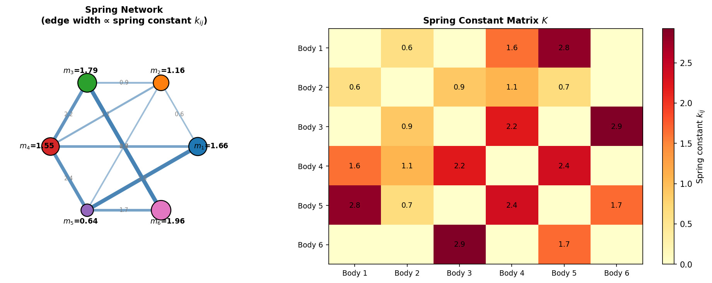
*Spring-mass graph: node size proportional to mass, edge width proportional to spring constant. This topology is fixed across all trajectories.*

---

## Simulated Dynamics

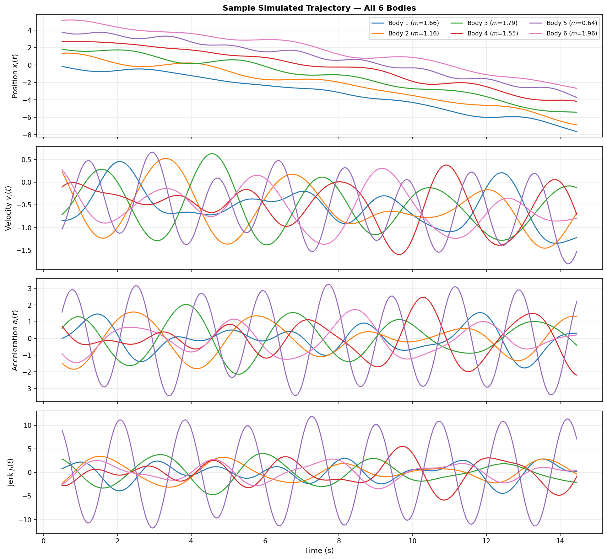
*All four kinematic quantities for a sample trajectory: position, velocity, acceleration (finite differences), and jerk (analytic). Jerk is oscillatory but not constant — it tracks the time-varying relative velocities between connected masses. The analytic jerk is used as the direct supervision signal during training.*

---

## Training

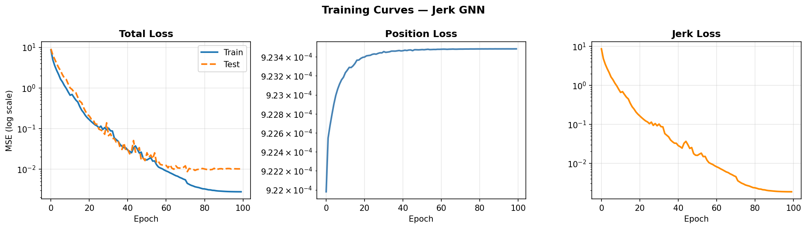
*Three loss panels: total, position, and jerk. Position loss converges quickly (dominated by the v·dt term) while jerk loss is the meaningful diagnostic — it reflects whether the model has learned the underlying interaction law.*

---

## Results

### Rollout: Predicted vs True Trajectories

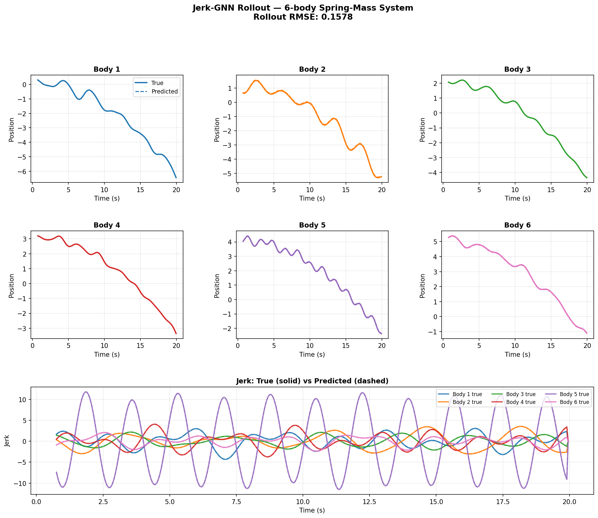
*Autoregressive rollout on a held-out trajectory. Predicted positions (dashed) track the true positions (solid) for several seconds before accumulating phase error. The jerk panel shows predicted jerk closely matching the analytic ground truth throughout the rollout.*

### Jerk Correlation

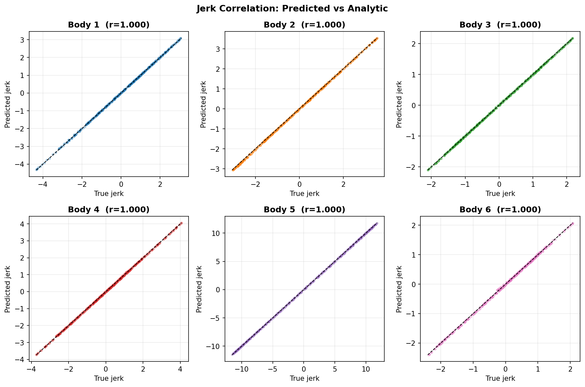
*Predicted vs analytic jerk for all 6 bodies over the full rollout. Pearson r = 1.000 for all bodies — the model has learned the correct interaction law. Without direct jerk supervision, this correlation is negative (r ≈ −0.7), as the position-only loss provides no useful gradient for jerk.*

### Velocity and Acceleration Rollout

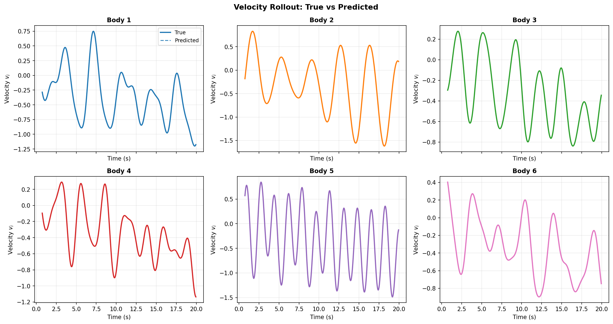
*True vs predicted velocity (estimated via finite differences on predicted positions).*

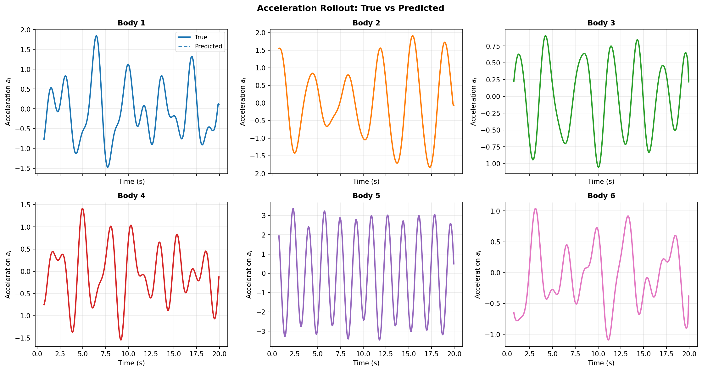
*True vs predicted acceleration. Errors grow as position errors compound through FD estimation.*

### Phase Portraits

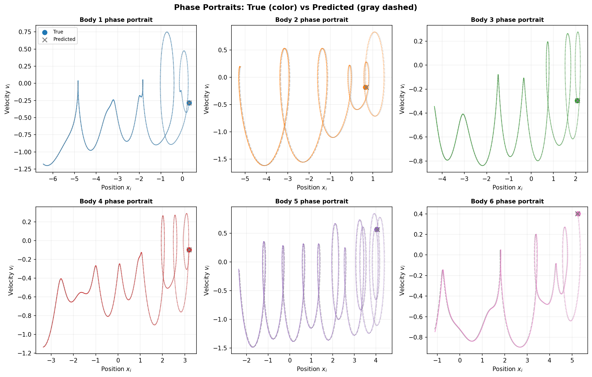
*State-space trajectories (x vs v) for each body. The predicted orbits (dashed) closely follow the true orbits (solid) in the early rollout before drifting.*

### Error Over Time

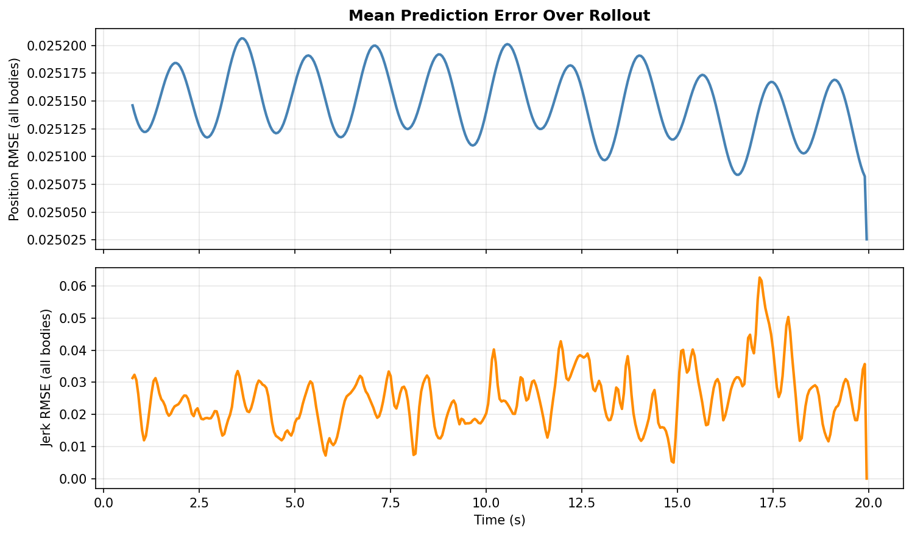
*Position RMSE (top) and jerk RMSE (bottom) as a function of rollout time. Position error is oscillatory around ~0.025 rather than diverging — the model captures the oscillatory structure but accumulates phase error gradually.*

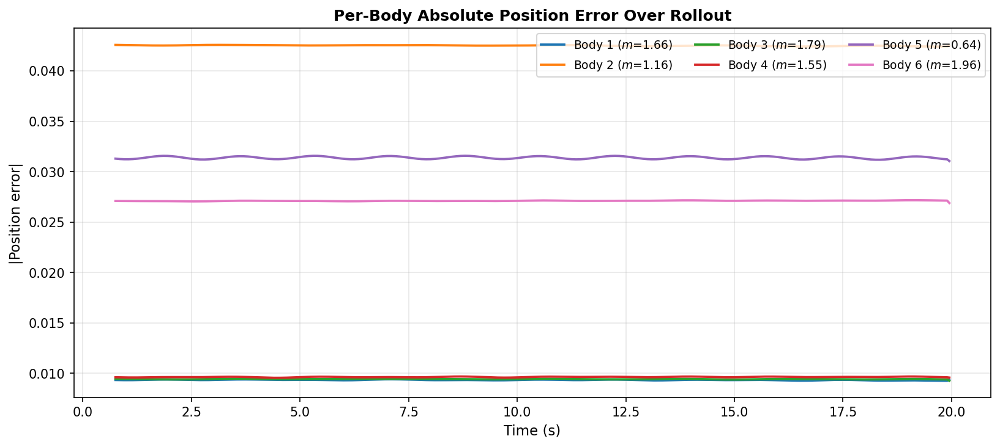
*Per-body absolute position error. Bodies with higher-frequency dynamics (lighter masses, more connections) tend to accumulate error faster.*

### Energy Conservation

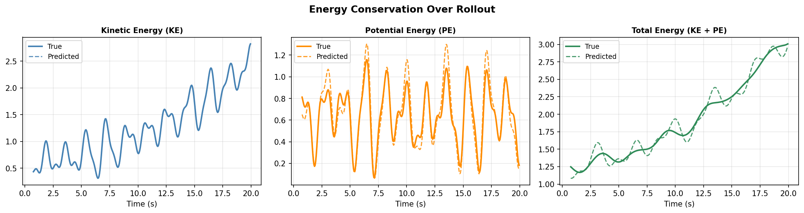
*Kinetic, potential, and total mechanical energy over the rollout. Energy conservation is not enforced by the architecture — drift in predicted total energy (green dashed) reflects cumulative model error. Upward drift indicates the model is slightly injecting energy into the predicted trajectory.*

---

## Files

| File | Description |
|------|-------------|
| `jerk_gnn.ipynb` | Simulation, model, training, and all plots |
| `jerk_gnn_summary.md` | Design decisions and architecture notes |
| `png/` | Output figures (regenerated by running the notebook) |

## Requirements

```
torch
torch-geometric
scipy
matplotlib
numpy
```

Install into the provided virtual environment:

```bash
module load cuda/12.8
source .venv/bin/activate
```

Or use the registered Jupyter kernel: **Spring-Mass (Jerk-GNN)**.

## References

- Kipf et al. (2018) *Neural Relational Inference for Interacting Systems*. [arXiv:1802.04687](https://arxiv.org/abs/1802.04687)
