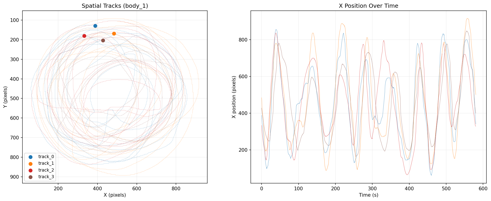
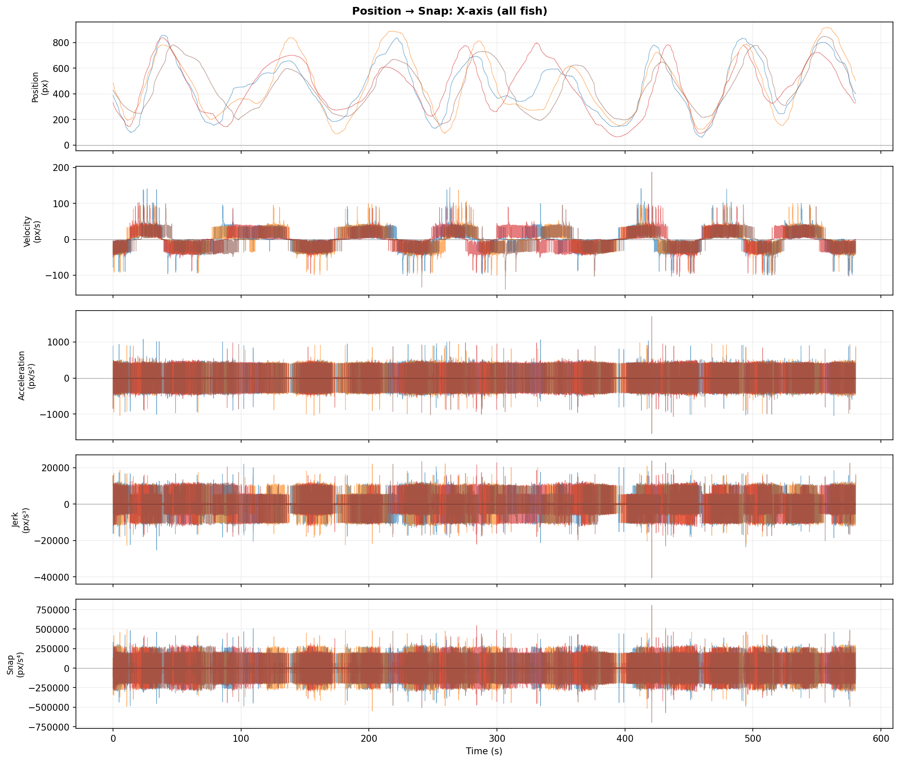
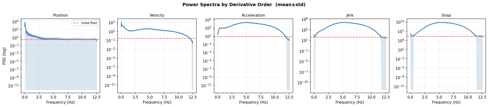
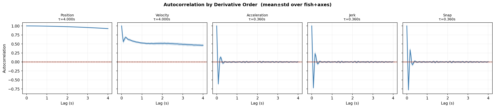
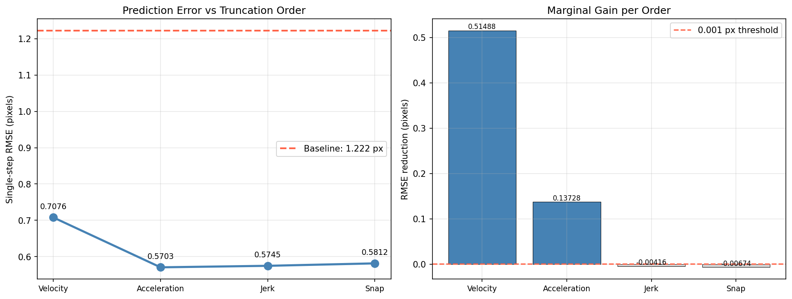
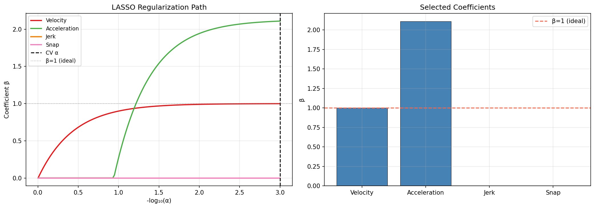
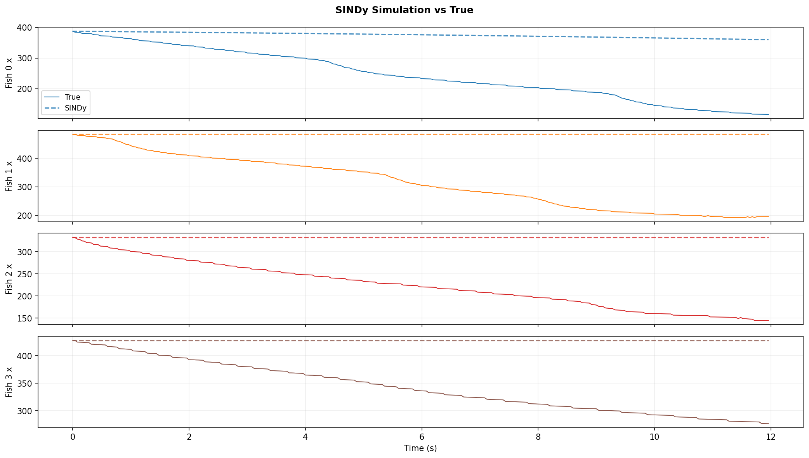
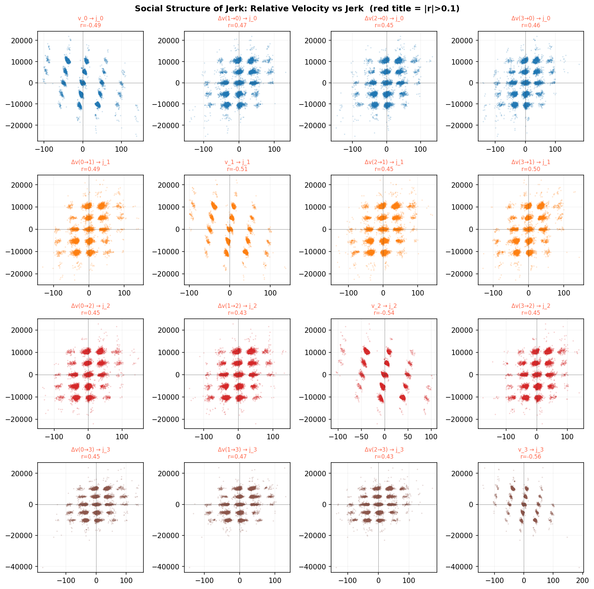

# Jerk-GNN: Learning Spring-Mass and Fish Collective Dynamics

A Graph Neural Network that predicts **jerk** (d³x/dt³) as the sole learned quantity, then integrates forward analytically via hard consistency to produce physically consistent trajectories. Applied first to a synthetic spring-mass testbed, then extended to real collective fish dynamics.

---

## Why Jerk?

Standard approaches predict position or acceleration directly. Jerk is the natural quantity to learn because for a spring-mass system the true jerk is:

```
j_i = (1/m_i) * Σ_j k_ij * (v_j - v_i)
```

This is a sum over neighbors — exactly the operation a GNN's message-passing implements. The GNN's learned edge weights are implicit proxies for unknown spring constants (implicit system identification).

**Key reframe for real data**: jerk is not just a Taylor correction term. It is the *governing equation* of social forcing:

```
j_i = f_θ({v_j − v_i}, {x_j − x_i})
```

The network's job is to predict how acceleration changes as a function of relative neighbor state. Position rollout follows from integrating this.

---

## Hard Consistency Integration

The GNN outputs jerk `j_i` per node. All other quantities follow analytically with no free parameters:

```
x(t+dt) = x + v·dt + ½a·dt² + ⅙j·dt³
v(t+dt) = v + a·dt + ½j·dt²
a(t+dt) = a + j·dt
```

O(dt⁴) accurate per step; exact if snap (d⁴x/dt⁴) = 0.

---

## Loss Function

Training uses a **normalized multi-term loss** so each component is dimensionless O(1):

```
L = ‖x_pred − x_true‖² / σ²_x  +  λ_a · ‖a_pred − a_true‖² / σ²_a  +  λ_j · ‖j_pred − j_true‖² / σ²_j
```

Normalizing by variance makes λ_a and λ_j interpretable as relative importance weights, not scale corrections. This design is necessary because:

- **Position loss alone** gives near-zero gradient signal to the jerk network (contribution is O(dt³) ≈ 10⁻⁴ at typical dt). Without direct jerk supervision, the model learns the wrong sign (r ≈ −0.7).
- **Pure jerk loss** is dominated by rare large-jerk events (threshold crossings); most timesteps have near-zero jerk → flat loss surface.
- **Multi-term normalized loss** trains slow dynamics (position), supervises the hardest-to-predict quantity (acceleration), and trains the social interaction law (jerk) simultaneously.

---

## Part 1: Synthetic Spring-Mass Testbed

6-body 1D spring-mass system with random masses, sparse spring connectivity, and natural lengths. Adapted from the NRI simulation (Kipf et al. 2018).

### Architecture
- **Nodes**: position history window (k=5) + FD-estimated velocity and acceleration
- **Edges**: pairwise spring connections with spring constant as edge feature
- **Message passing**: 3-layer GNN with residual connections, hidden dim 64
- **Output**: scalar jerk per node → integrated to get next state


*Spring-mass graph: node size proportional to mass, edge width proportional to spring constant.*

---

### Simulated Dynamics


*Position, velocity, acceleration, and jerk for a sample trajectory. Jerk is oscillatory — it tracks time-varying relative velocities between connected masses. The analytic jerk is used as direct supervision.*

---

### Training


*Total, position, and jerk loss panels. Position loss converges quickly (dominated by v·dt); jerk loss is the meaningful diagnostic — it reflects whether the model has learned the underlying interaction law.*

---

### Results

#### Rollout: Predicted vs True


*Autoregressive rollout on a held-out trajectory. Predicted positions (dashed) track true positions (solid) for several seconds before accumulating phase error.*

#### Jerk Correlation


*Predicted vs analytic jerk for all 6 bodies. Pearson r = 1.000 — the model has learned the correct interaction law.*

#### Velocity and Acceleration Rollout


*True vs predicted velocity.*


*True vs predicted acceleration. Errors grow as position errors compound through FD estimation.*

#### Phase Portraits


*State-space trajectories (x vs v). Predicted orbits (dashed) closely follow true orbits (solid) in early rollout before drifting.*

#### Error Over Time


*Position RMSE (top) and jerk RMSE (bottom) vs rollout time. Position error is oscillatory around ~0.025 — the model captures the oscillatory structure but accumulates phase error gradually.*


*Per-body position error. Bodies with higher-frequency dynamics (lighter masses, more connections) accumulate error faster.*

#### Energy Conservation


*Kinetic, potential, and total mechanical energy over rollout. Energy conservation is not enforced — upward drift in total energy reflects cumulative model error (slight energy injection).*

---

## Part 2: Real Fish Collective Dynamics

### Fish Data

**Source**: SLEAP pose tracking of 4 three-spined stickleback (*Gasterosteus aculeatus*) at 28 days post-fertilization (28 dpf).

**File**: `data/skeleton_28dpf_v1 complete_500_002_testinference.000_rlt_250731_v0.analysis.h5`

**Format**: SLEAP HDF5 with `tracks` array of shape `(4, 2, 6, 14510)` → `(fish, xy, node, frame)`.
- 4 fish, 6 body nodes (eye_L, eye_R, body_1, body_2, body_3, tail), 14510 frames (~9.7 min at 25 fps)
- >99% tracking completeness
- Analysis uses `body_1` (midpoint node); mean step size ~1.09 px, std ~1.34 px

---

### Derivative Order Analysis (`fish_derivative_analysis.ipynb`)

Before training, we determined which derivative orders carry meaningful signal at 25 fps. Key findings:

**Taylor term magnitudes** (relative to step size):
- Velocity: ~81% of step
- Acceleration: ~19% of step
- Jerk: ~5.7% of step — but see reframe below

**LASSO order selection**: LASSO selected velocity + acceleration only; jerk Taylor term was zeroed out. At 25 fps, jerk contributes ∝ dt³ ≈ 6×10⁻⁵ to single-step position prediction — invisible to a position-only model.

**Social jerk structure**: Pairwise Pearson |r| between fish jerk and relative velocity of neighbors (v_j − v_i) exceeded 0.1 for all fish pairs. This confirms the GNN message-passing architecture is appropriate — jerk encodes real fish-fish interaction.


*Raw SLEAP position tracks for all 4 fish over the full recording. NaN gaps (tracking failures) are interpolated before analysis.*


*Position, velocity, acceleration, and jerk time series estimated via central finite differences. Acceleration and jerk are substantially noisier than position — FD amplifies high-frequency noise at each order.*


*Power spectral density of position for each fish. The spectrum rolls off at high frequencies, confirming that finite-difference jerk at 25 fps is dominated by measurement noise rather than true dynamics.*


*Autocorrelation of velocity and acceleration. Structured autocorrelation confirms that v and a carry real signal; jerk autocorrelation decays quickly (consistent with FD noise at this sampling rate).*


*Taylor RMSE vs derivative order. Adding velocity and acceleration progressively reduces single-step prediction error; jerk provides no further improvement at 25 fps (Taylor term ∝ dt³ ≈ 6×10⁻⁵).*


*LASSO coefficient paths for derivative order selection. Velocity and acceleration are retained; jerk coefficient is zeroed — confirming order 2 is sufficient for single-step position prediction at this sampling rate.*


*SINDy sparse regression on fish kinematics. Identifies the dominant terms in the equation of motion from data.*


*Pairwise Pearson r between fish jerk and relative neighbor velocity (v_j − v_i). All pairs exceed |r| > 0.1 — jerk encodes real fish-fish interaction, confirming GNN message-passing is the right architecture even though jerk doesn't help single-step position prediction.*

**Reconciling LASSO and social analysis**: These are not contradictory. LASSO asks "does jerk improve single-step position prediction?" — No, it's invisible at this timescale. Social analysis asks "does jerk correlate structurally with relative neighbor state?" — Yes. Jerk is the governing social equation, not a Taylor correction.

**Threshold/event-triggered hypothesis**: Changes in fish acceleration are bursty, not smooth. Fish likely respond to neighbors crossing a proximity or speed threshold. Diagnostics to check:
- Jerk distribution: heavy-tailed or bimodal → threshold/spike process
- Conditional analysis: bin timesteps by nearest-neighbor distance; check if r(j_i, v_j−v_i) is strong at close range and near zero at distance
- Synchronous jerk spikes: plot mean |j| across fish over time — bursts = collective events

---

### Fish GNN (`fish_gnn.ipynb`)

Mirrors the spring-mass notebook but adapted for real data.

**Architecture** (`FishGNN`):
- **Nodes**: each fish; features = position history window (k=5) + current FD velocity
- **Edges**: fully connected (social topology unknown, learned implicitly)
- **Output**: 2D acceleration AND jerk per fish (two separate output heads)
- **Integration**: order-3 hard consistency — same equations as spring-mass

**Loss**: normalized 3-term loss (position / σ²_x + λ_a · accel / σ²_a + λ_j · jerk / σ²_j). Variances computed from training data so terms start at O(1) and λ_a, λ_j are interpretable.

Plots (`fish_curves.png`, `fish_rollout.png`, `fish_corr.png`, `fish_error.png`, `fish_spatial.png`) are generated by running the notebook.

**Key differences from spring-mass**:
- 2D positions (x, y) instead of 1D
- Fully connected edges (no known topology)
- FD jerk as supervision signal (noisy but usable)
- Train/test split on frames (80/20), not trajectories

---

## Planned Extensions

**Spring-mass modifications** (synthetic testbed, simplest first):

1. **Distance-gated springs**: `F_ij = k_ij*(x_j−x_i−l_ij) * 1[|x_j−x_i| < r*]` — produces sparse event-triggered jerk; tests whether GNN can recover threshold r* from data
2. **Velocity-dependent (viscous) coupling**: adds c_ij*(v_j−v_i) term; jerk depends on relative acceleration
3. **Two-timescale dynamics**: separates slow individual swimming from fast social collision avoidance
4. **Soft threshold**: sigmoid gating; GNN learns as attention weight over edges
5. **Stochastic forcing**: tests separation of social forcing from intrinsic noise

**Diagnostics for model underspecification**:
- *Structured residuals*: if derivative order is wrong, rollout errors correlate with the missing derivative. Plot rollout error vs instantaneous |jerk| — spikes during high-jerk events indicate the model is underspecified.
- *dt-invariance*: train at two different dt values — if learned coefficients change substantially, the model is absorbing missing Taylor terms. A correctly specified model's coefficients should be dt-invariant.

---

## Files

| File | Description |
|------|-------------|
| `jerk_gnn.ipynb` | Spring-mass simulation, model, training, and plots |
| `fish_derivative_analysis.ipynb` | Statistical analysis of fish tracking data — derivative order selection, social jerk structure |
| `fish_gnn.ipynb` | FishGNN training on real SLEAP data — normalized multi-term loss, order-3 hard consistency |
| `jerk_gnn_summary.md` | Design decisions and architecture notes |
| `png/` | Output figures |
| `data/` | SLEAP HDF5 tracking data (not tracked in git) |

---

## Requirements

All dependencies are pinned in `requirements.txt`. The environment requires Python 3.10 and CUDA 12.x.

### First-time setup

```bash
# Load modules (BU SCC)
module load python3/3.10.12
module load cuda/12.8

# Create virtual environment
python3 -m venv .venv

# Install dependencies
.venv/bin/pip install -r requirements.txt
```

### Subsequent use

```bash
module load cuda/12.8
source .venv/bin/activate
```

### Jupyter kernel

The environment is registered as a Jupyter kernel named **Spring-Mass (Jerk-GNN)**. To reinstall it after recreating the venv:

```bash
.venv/bin/python -m ipykernel install --user --name spring-mass --display-name "Spring-Mass (Jerk-GNN)"
```

---

## References

- Kipf et al. (2018) *Neural Relational Inference for Interacting Systems*. [arXiv:1802.04687](https://arxiv.org/abs/1802.04687)
